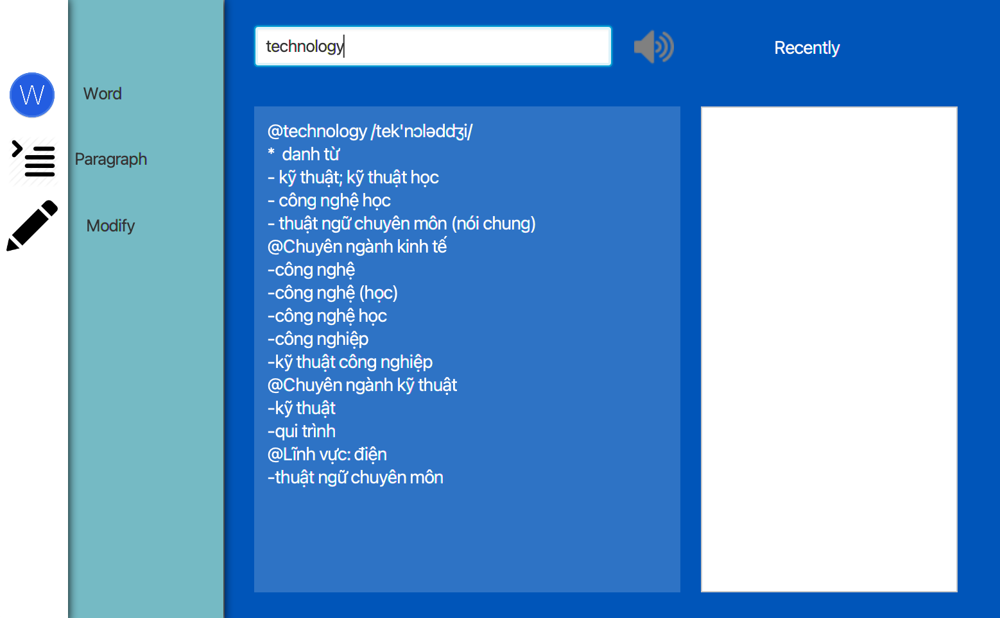
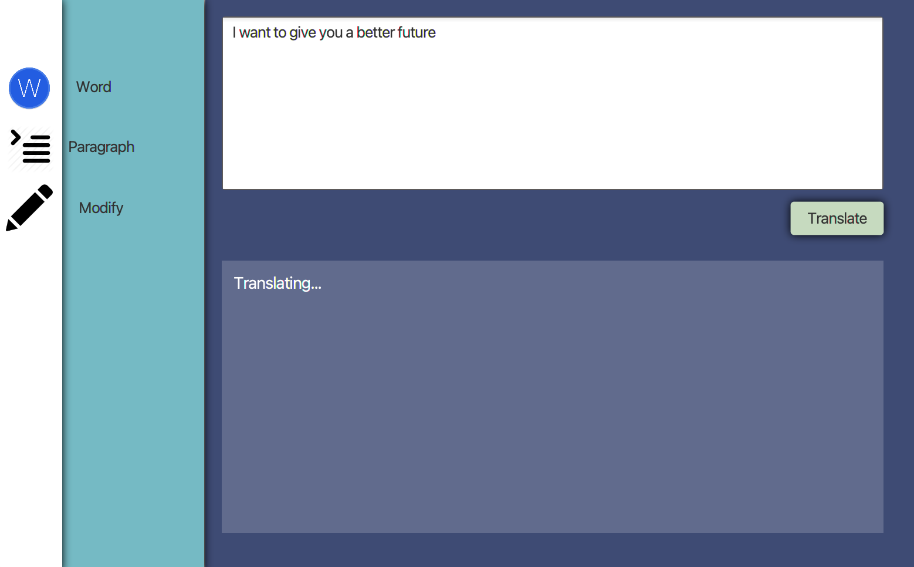
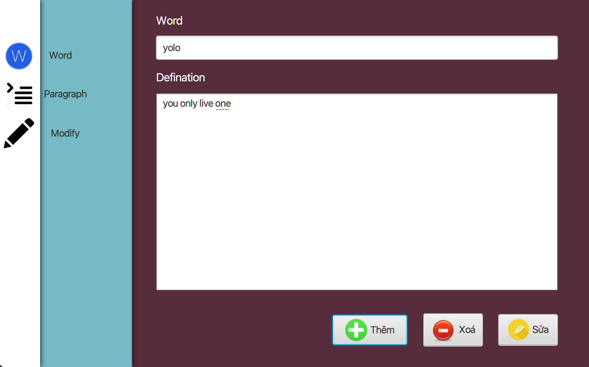

# yDictionary
Dictionary application. Vocabulary list can be customized. Including Oxford, Cambridge... dictionary. Free to add your own dictionary. Using JavaFX. 

### Preparation
- Java JDK 10
- JavaFX SDK 11
- controlsfv 11.1.1
- jlayer-1.0.1
- jfoenix-9.0.6
- openjfx.javafx.graphics
- openjfx.javafx.fxml
- openjfx.javafx.base
- openjfx.javafx.controls

### Run
Using command:
```aiignore
/home/cong/.jdks/openjdk-23.0.2/bin/java --module-path=/home/cong/Downloads/javafx-sdk-11/lib --add-modules=javafx.controls,javafx.fxml,javafx.base,javafx.graphics --add-exports javafx.base/com.sun.javafx.event=ALL-UNNAMED -javaagent:/snap/intellij-idea-community/588/lib/idea_rt.jar=40611 -Dfile.encoding=UTF-8 -Dsun.stdout.encoding=UTF-8 -Dsun.stderr.encoding=UTF-8 -classpath /home/cong/IdeaProjects/yDictionary/out/production/v1:/home/cong/IdeaProjects/yDictionary/lib/jlayer-1.0.1.jar:/home/cong/IdeaProjects/yDictionary/lib/jfoenix-9.0.6.jar:/home/cong/.m2/repository/org/openjfx/javafx-graphics/11/javafx-graphics-11.jar:/home/cong/.m2/repository/org/openjfx/javafx-graphics/11/javafx-graphics-11-linux.jar:/home/cong/.m2/repository/org/openjfx/javafx-base/11/javafx-base-11.jar:/home/cong/.m2/repository/org/openjfx/javafx-base/11/javafx-base-11-linux.jar:/home/cong/.m2/repository/org/openjfx/javafx-fxml/11/javafx-fxml-11.jar:/home/cong/.m2/repository/org/openjfx/javafx-fxml/11/javafx-fxml-11-linux.jar:/home/cong/.m2/repository/org/openjfx/javafx-controls/11/javafx-controls-11.jar:/home/cong/.m2/repository/org/openjfx/javafx-controls/11/javafx-controls-11-linux.jar:/home/cong/.m2/repository/org/controlsfx/controlsfx/11.1.1/controlsfx-11.1.1.jar Main
```
Using IntelliJ IDEA: Open Project Structure, add all *.jar files in `lib` folder.


### Demonstration
<div style = "display: flex; justify-content: center;">
  <div style = "width: 250px; 
  margin: 0 1rem;
    margin-bottom : 1.5rem;">
      
  </div>
  <div style = "width: 250px; 
  margin: 0 1rem;
    margin-bottom : 1.5rem;">
      
  </div>
  <div style = "width: 250px; 
  margin: 0 1rem;
    margin-bottom : 1.5rem;">
      
  </div>
</div>

